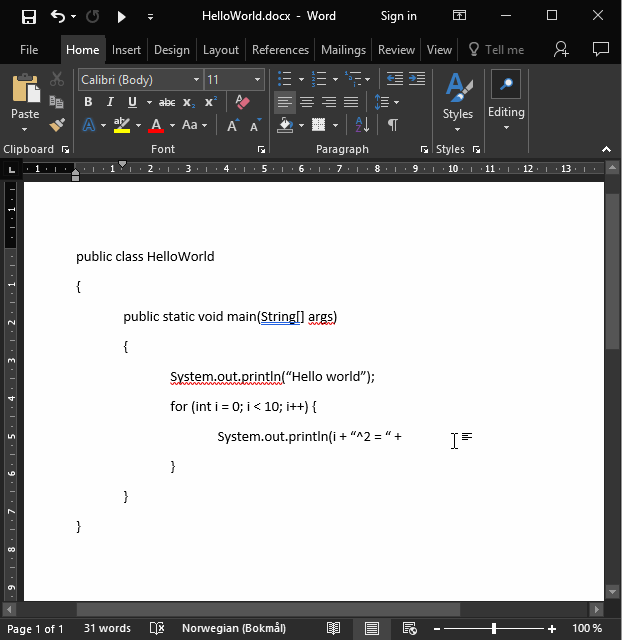

# JavaWord

Microsoft Word as a Java "IDE"

    

## Setup

Set the path to Java's `\bin` (at the top in the macro).

## Use

Copy or modify the provided `.docm` file. Alternatively, you can import the [macro](./JavaWord.bas) using any `.docm` file.

Of course, make sure your Word document has the same name as your Java class!

To build and run, click **Macros** under the **View** tab. Make sure **JavaWord** is selected, then click **Run**.

### Adding a shortcut to the quick access toolbar

To add a shortcut to the macro in the quick access toolbar (as shown in the example above), follow these steps:

1. Right click on one of the icons at the top left (e.g. save, undo, redo) and select **Customize Quick Access Toolbar...**

2. Under **Chose commands from**, select **Macros**

3. Select the macro (should be **Project.NewMacros.JavaWord**), and click **Add >>**

4. (optional) To change the icon to the usual "run" icon (triangle), click **Modify...**, select the icon, and click **OK**

5. Click **OK** to close

You can now run your code by simply clicking the newly added button!
